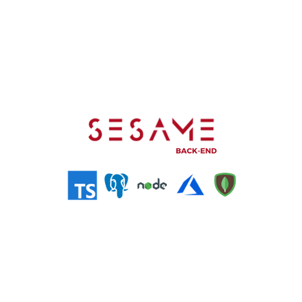

 

 

## How to use ?

After Cloning the dependency make sure to install of the needed dependencies and fill in the .env file with the correct credentials

Ideally, you should create a MS azure account for the facial recognition and sign up a service with the face API.
Furthermore, you should create a PostgreSQL db on a cloud service and a MongoDB atlas cluster.

Once all of these accounts created you are ready to go!

   `npm install`
   `npm run dev:watch`
   `npm run start (for built version)`

Finally, a docker file is setup so you can also run the following:

` docker build <Your docker image name> .`

and

`docker run -it -p 5000:5005 <Your docker image name>`

## Dependencies
    "body-parser": "^1.19.0",
    "class-validator": "^0.13.1",
    "cors": "^2.8.5",
    "express": "^4.17.1",
    "http": "0.0.1-security",
    "mongoose": "^5.11.14",
    "node-fetch": "^2.6.1",
    "nodemailer": "^6.4.17",
    "pg": "^8.5.1",
    "pino-pretty": "^4.4.0",
    "reflect-metadata": "^0.1.13",
    "typeorm": "^0.2.30"

## Usage

This is essential for running Sesame without it the app and admin Dashboard will not run.

